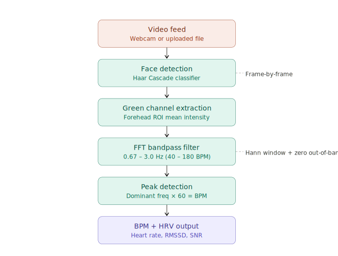

# RPPG — Remote Heart Rate Estimation from Video

Estimate heart rate (BPM) from facial or fingertip video using classical signal processing — no machine learning, no wearable sensors.

The pipeline detects a face via Haar Cascade, extracts the green-channel intensity frame by frame, applies an FFT bandpass filter (0.67–3 Hz → 40–180 BPM), and finds the dominant pulse frequency.



---

## Repository Structure

```
RPPG/
│
│   ── Streamlit web app (Option A: quickest way to run) ──
├── app.py                     ← Streamlit front-end
├── sigMain.py                 ← Signal processing module (FFT, peak detection, HRV)
├── SNR.py                     ← Signal-to-noise ratio helper
├── requirements.txt           ← Python dependencies for the Streamlit app
│
│   ── Full-stack web app (Option B: FastAPI + JS frontend) ──
├── rppg-app/
│   ├── README.md              ← Docs specific to the full-stack app
│   ├── docker-compose.yml
│   ├── backend/
│   │   ├── main.py            ← FastAPI server with its own DSP pipeline
│   │   ├── requirements.txt   ← Backend-only dependencies
│   │   └── Dockerfile
│   └── frontend/
│       └── index.html         ← Single-page vanilla JS client
│
│   ── Original research scripts ──
├── Face rppg.ipynb            ← Jupyter notebook: face-based rPPG from video file
├── Fingertip rppg.py          ← Standalone script: fingertip HSV V-channel
│
│   ── Assets & config ──
├── flowchart.svg              ← Pipeline flowchart (shown below)
├── face rppg flowchart.png    ← Original hand-drawn flowchart
├── results.png                ← Sample output screenshot
├── LICENSE                    ← MIT
├── .gitignore
└── README.md
```

> **Note:** Test videos go in a `Samples/` folder at the repo root. This folder is
> git-ignored, so you need to create it yourself and add your own `.mp4` / `.avi` / `.mov` files.

---

## Quick Start — Streamlit App

The fastest way to run the project. Works on Windows, macOS, and Linux.

### Prerequisites

- Python 3.9 or higher
- pip
- A webcam (optional, for live mode)

### Steps

```bash
# 1. Clone the repo
git clone https://github.com/Achintya-Tiwari/RPPG.git
cd RPPG

# 2. Create a virtual environment (recommended)
python -m venv venv

# Windows
venv\Scripts\activate

# macOS / Linux
source venv/bin/activate

# 3. Install dependencies
pip install -r requirements.txt

# 4. Run the app
streamlit run app.py
```

The app opens at `http://localhost:8501`. Upload a video of a face (or use your webcam) and click **Analyze**.

---

## Full-Stack App — Docker (FastAPI + Frontend)

A more polished version with a custom frontend, REST API, and Docker deployment.

### Prerequisites

- Docker and Docker Compose

### Steps

```bash
# 1. Clone the repo (skip if already done)
git clone https://github.com/Achintya-Tiwari/RPPG.git
cd RPPG/rppg-app

# 2. Build and start both services
docker compose up --build

# 3. Open in browser
#    Frontend  →  http://localhost:3000
#    API docs  →  http://localhost:8000/docs
```

To stop: `Ctrl+C` or `docker compose down`.

### Running Without Docker

```bash
cd rppg-app/backend
python -m venv venv
venv\Scripts\activate          # macOS/Linux: source venv/bin/activate
pip install -r requirements.txt
uvicorn main:app --reload --port 8000
```

Then open `rppg-app/frontend/index.html` in a browser. If CORS errors occur, serve the frontend with:

```bash
cd rppg-app/frontend
python -m http.server 3000
```

---

## Running the Original Research Scripts

These are the standalone scripts from the initial research phase. They are included in the repo at the root level alongside the web apps. All dependencies are covered by the same `requirements.txt`, so if you already ran `pip install -r requirements.txt` you're set.

### Face-based (Jupyter Notebook)

```bash
# Install Jupyter if you don't have it
pip install jupyter

# Launch the notebook
jupyter notebook "Face rppg.ipynb"
```

Create a `Samples/` folder at the repo root and place your test video inside it (e.g. `Samples/face_video.mp4`). Update the file path inside the notebook to match.

### Fingertip-based

```bash
python "Fingertip rppg.py"
```

By default the script looks for `Samples/82.mp4` — update the path in the script to point to your own fingertip video.

> **Note:** The original scripts use `sigMain.py` and `SNR.py` from the repo root.
> Both files must be present for the scripts to run.

---

## Video Tips for Best Results

| Factor | Recommendation |
|---|---|
| Duration | 10–60 seconds (longer = more accurate) |
| Format | MP4, AVI, MOV, or WebM |
| Lighting | Even, frontal light — avoid backlighting or flickering |
| Face | Clearly visible, minimal head movement |
| Fingertip | Press fingertip lightly against the camera lens with flash on |

---

## How It Works

1. **Face detection** — Haar Cascade locates the face (or forehead ROI) in each frame
2. **Signal extraction** — Mean green-channel intensity (face) or HSV V-channel (fingertip) per frame
3. **Resampling** — Signal is upsampled 2.1× for finer frequency resolution
4. **FFT bandpass** — Frequencies outside 0.67–3.0 Hz are zeroed out
5. **Peak detection** — `scipy.signal.find_peaks` identifies heartbeat peaks
6. **BPM** — Dominant frequency × 60 gives beats per minute
7. **HRV** — RMSSD computed from successive RR-interval differences

---

## Limitations

- Requires a clearly visible face throughout the video
- Performance degrades with strong motion, poor lighting, or occlusion
- Results are **indicative only** — this is not a medical device
- Single-face detection only

---

## License

MIT — see [LICENSE](LICENSE) for details.